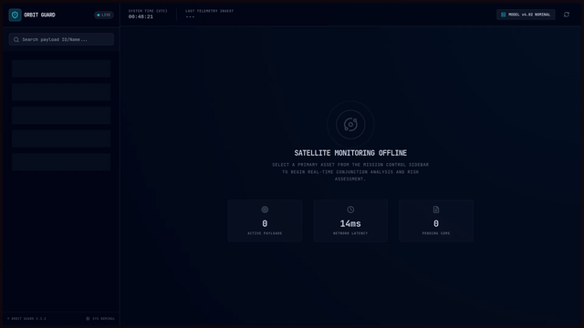
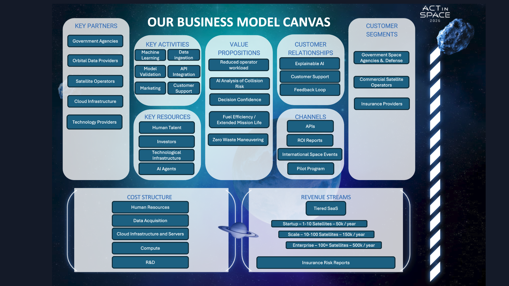

# 🛰️ OrbitGuard
**AI-Powered Collision Risk Intelligence for Satellite Operators** | ActInSpace 2026

Built in 24 hours at ActInSpace 2026. As a first-year CS student, I led a team of 4 to develop an AI system that filters critical satellite collision warnings from thousands of daily false positives. Our LSTM learns how risk evolves over time and tells operators exactly when they need to act.

ActInSpace isn't just about tech demos. We pitched OrbitGuard as a SaaS platform with a full business model targeting commercial satellite operators.

## 🎬 Demo



*Real-time risk assessment, trends, and uncertainty indicators in action.*

## 👥 Team

| Name | Role | Contributions |
|------|------|---------------|
| **Aayush Prakash** | Team Lead | Coordinated team, architecture decisions, delivered final pitch |
| **Mostafa Sherif** | ML Engineer | Skip-connection LSTM, preprocessing pipeline, uncertainty quantification |
| **Jonty McBreen-Graham** | Software Engineer | TypeScript backend, API integration, deployment |
| **Nathan Rawiri** | Aerospace Engineer | Orbital mechanics research, pitch deck, domain expertise |

## 🎯 The Problem

Satellite operators receive 20-30 collision warning updates per event over a week. Most are noise. Current systems treat each message independently, so it's impossible to track whether risk is increasing or decreasing. OrbitGuard learns temporal patterns and tells operators when to act, not just the risk level.

## 🧠 The Solution

### Data Pipeline
Raw CDMs come as JSON snapshots sourced from [Space-Track.org](https://www.space-track.org). We built an ETL pipeline that:
- Groups messages by event
- Reconstructs the timeline
- Log-scales miss distance (10 km → 10 m)
- Pads sequences for batch processing

### Neural Network

**Version 1: Standard LSTM**  
Learned temporal patterns but slow on sudden probability jumps. Validation loss: 1.5e-5

**Version 2: Skip-Connection LSTM (Final)**  
Residual skip connection gives direct access to latest probability alongside full history.

Results:
- Validation loss: 3.0e-6 (5x better)
- Faster convergence
- Better at catching sudden risk changes

### Dashboard

🚦 **Status:** ESCALATING | STABLE | RESOLVING

⏳ **Time of Last Opportunity:** Hours left to upload maneuver

📈 **Risk Trends:** INCREASING | DECREASING | STABLE

🔮 **Uncertainty:** Monte Carlo Dropout gives confidence scores (e.g., 98% vs 60%)

## 🚀 Quick Start

```bash
git clone https://github.com/CelestiAI-Org/Orbitguard.git
cd Orbitguard

# Create .env file
echo "ST_IDENTITY=your_email@example.com" >> .env
echo "ST_PASSWORD=your_password" >> .env

# Run
chmod +x ./start.sh
./start.sh
```

Or open in [DevContainer](https://containers.dev/).


## 📊 Example Output

| Event | TCA | Status | Hours Left | Trend | Certainty |
|-------|-----|--------|-----------|-------|-----------|
| Sat A vs Sat B | Dec 25, 12:00 | 🛑 ESCALATING | 4.5 hrs | 📈 INCREASING | 98% |
| Sat X vs Sat Y | Dec 26, 09:00 | ✅ RESOLVING | 28.0 hrs | 📉 DECREASING | 99% |

## 💼 Business Model



OrbitGuard was pitched as SaaS for:
- Commercial operators (Planet, Spire)
- Emerging space nations
- Insurance companies

Tiered subscriptions based on satellite fleet size. Avoiding just one collision pays for decades of service.

The presentation can be found in [assets](assets/) directory

## 🛠️ Tech Stack

Python • PyTorch/TensorFlow • TypeScript • Docker • DevContainers

## 🌠 Reflection

Leading a technical team at a hackathon is chaotic, especially when you're a first-year CS student coordinating an aerospace engineer, ML engineer, and software engineer. This was my second time doing it, and I still had impostor syndrome at times. But you have 24 hours to build something that works AND pitch it as a viable business.

**On leadership:**  
Making fast decisions about what's realistic vs nice-to-have is hard. We cut features like real-time orbital propagation because they weren't achievable. Learning to trust your team while coordinating was key. Nathan's aerospace expertise gave us credibility which helped us learn about orbital mechanics.

**On the business side:**  
Nathan built the pitch deck and worked on the business model canvas alongside me, then I practiced the pitch. Having an actual aerospace engineer made a huge difference when judges asked technical questions. Meanwhile, Mostafa and Jonty were finishing the ML pipeline.

**On ML:**  
The skip connection was Mostafa's idea we almost didn't try. He spent 4 hours at 2am debugging it. Turns out it gave us 5x improvement. Sometimes weird ideas are worth pursuing, and trusting your team's instincts is part of leading.

**On collaboration:**  
Everyone brought something different. Mostafa knew ML inside out, Jonty kept infrastructure from falling apart, Nathan understood the actual aerospace problem, and I made sure we had a cohesive story. The best part was seeing it come together in the final pitch.

The judges liked that we built something that could actually become a company. That's what ActInSpace is about.

---

**Built by NEO-FLUX Team for ActInSpace 2026**  
*Making space safer, one prediction at a time.*
